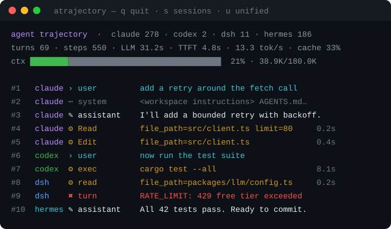

# 🛰️ Agent Trajectory

[](https://opensource.org/licenses/MIT)
[](https://nodejs.org)
[](https://www.typescriptlang.org/)
[](#-agent-coverage)
[](http://makeapullrequest.com)

A read-only terminal monitor for AI coding agents. It watches the session logs your agents already write and shows every tool call, model response, token count and context gauge in one live, time-ordered feed — across Claude Code, Codex, DeepSeek Harness and Hermes at the same time.



---

## 📑 Table of Contents

- [✨ Key Features](#-key-features)
- [🚀 Installation](#-installation)
  - [Install from source (recommended today)](#install-from-source-recommended-today)
  - [Requirements](#requirements)
- [📖 Usage](#-usage)
  - [Get help](#get-help)
  - [Common scenarios](#common-scenarios)
  - [Keys](#keys)
  - [Options](#options)
- [🔍 Reading the Screen](#-reading-the-screen)
- [🤖 Agent Coverage](#-agent-coverage)
- [📂 Where It Reads](#-where-it-reads)
- [🔒 Privacy and Safety](#-privacy-and-safety)
- [🛠️ Troubleshooting](#️-troubleshooting)
- [🧩 Development](#-development)
- [🗺️ Known Limitations](#️-known-limitations)
- [📝 License](#-license)
- [🙏 Acknowledgments](#-acknowledgments)

## ✨ Key Features

- **🤖 Every agent at once** — Claude Code, Codex, DeepSeek Harness and Hermes in a single merged feed, each row tagged with the agent that produced it.
- **🔭 Actions, not just totals** — tool calls with argument previews and durations, model responses, injected context, and failures, in the order they happened.
- **📊 Real metrics** — turns, steps, model wall time, time-to-first-token, decode throughput, cache hit rate and token counts, taken from what the agent actually logged.
- **📏 Context gauge** — occupancy against the model's own reported window, so you can see compaction coming.
- **🎯 Focus what matters** — `--cwd` narrows to the project you're standing in; the session picker jumps to any recent session across any agent.
- **💵 Cost tracking** — free-tier models are recognised automatically; everything else prices from a table you own.
- **⏱️ Live by default** — a relative-age column and a heartbeat, so a stalled monitor never looks like an idle agent.
- **🔇 Quiet by default** — injected context is hidden and repeated lines collapse to `×7`, leaving the actions visible.
- **🚫 No fabricated numbers** — a figure an agent doesn't record shows as `—`, never as a misleading `0`.
- **🪶 Nearly dependency-free** — `ink` and `react`, nothing else. Zstandard decoding uses Node's own `zlib`.
- **🔒 Read-only and offline** — no writes, no locks, no network, no telemetry, no config file.

## 🚀 Installation

### Install from source (recommended today)

```bash
git clone https://github.com/shaswatco/agent-trajectory.git
cd agent-trajectory
npm install -g .
```

Then run it from anywhere:

```bash
atrajectory
```

There is nothing to configure. It finds your agents' session stores on its own and starts showing them.

> **Not on the npm registry yet.** `npm install -g agent-trajectory` will 404 until it is published, and installing straight from a git URL is unreliable — npm links the package to a cache clone it then deletes, leaving a dangling command. Clone and install from the directory instead.

### Requirements

Node **22.15 or newer**, for native Zstandard support in `node:zlib`. No Python, no build toolchain, no API keys.

## 📖 Usage

### Get help

```bash
atrajectory --help
```

### Common scenarios

```bash
# Watch everything, newest activity first
atrajectory

# Only the project you're standing in
atrajectory --cwd

# One agent
atrajectory --agent claude

# A couple of them
atrajectory --agent claude,codex

# Pin a single session log
atrajectory --session ~/.claude/projects/-home-me-app/abc123.jsonl
```

Run it in a second terminal beside your agent and rows appear as work happens.

### Keys

| Key | Action |
|-----|--------|
| `q` | quit |
| `s` | toggle the session picker |
| `u` | return to the unified feed |
| `0`–`9` | jump to that session |
| `↑` `↓` / `k` `j` | scroll one row |
| `PgUp` `PgDn` | scroll one page |
| `g` / `G` | jump to oldest / newest |

### Options

| Flag | Default | Meaning |
|------|---------|---------|
| `--agent <list>` | all | comma-separated: `claude`, `codex`, `deepseek`, `hermes` |
| `--cwd [dir]` | off | only sessions recorded under `dir`; bare flag means `$PWD` |
| `--session <path>` | — | pin one session instead of the unified feed |
| `--merge <n>` | `6` | sessions merged into the unified feed |
| `--interval <ms>` | `1000` | poll interval |
| `--history <n>` | `5000` | rows kept for scrollback |
| `--verbose` | off | include injected-context rows |
| `--pricing <path>` | see below | model price and capacity table |

## 💵 Costs and Context Windows

Two numbers can't be inferred from a log: what a model costs, and how large its
context window is when the agent doesn't record one. Both come from a file you
own, so nothing here is guessed on your behalf.

```bash
mkdir -p ~/.config/agent-trajectory
cp doc/pricing.example.json ~/.config/agent-trajectory/pricing.json
```

```json
{
  "claude-sonnet-5": { "contextWindow": 1000000, "input": 3, "output": 15, "cacheRead": 0.3, "cacheWrite": 3.75 },
  "gpt-5.6": { "input": 1.25, "output": 10 }
}
```

Prices are USD per million tokens. Model ids are matched after stripping
provider prefixes and deployment suffixes, so `z-ai/glm-4.5-air:free`,
`glm-4.5-air:cloud` and `glm-4.5-air` all resolve to one entry.

- **Free tiers cost nothing**, and ids ending `-free` or `:free` are detected without configuration.
- **An unpriced model shows `$—`**, never `$0.00`.
- **`contextWindow` is only needed for Claude Code.** Codex and DeepSeek Harness log their own, and a logged value always wins.
- **A window your usage exceeds is discarded**, not clamped — a bar pinned at 100% because the configured capacity is wrong reads exactly like a context about to overflow, which is the one thing the gauge exists to warn about.

## 🔍 Reading the Screen

The top line names the view and counts sessions per agent. Below it, the metrics strip, then the context gauge — green under 70%, yellow past that, red past 90%.

Each feed row is one event:

| Glyph | Meaning |
|-------|---------|
| `›` | a prompt you actually typed |
| `⋯` | injected context — instruction files, system prompts, tool results |
| `✎` | model response |
| `⚙` | tool call, with an argument preview and duration |
| `✖` | a failure — a tool error, or a turn that ended aborted or errored |

The `›` versus `⋯` split is the one worth internalising: it separates what you asked for from the tens of thousands of tokens of context the agent injects around it.

### Scrolling

The feed follows the newest row until you scroll away from it. While scrolled
back the header shows `PAUSED 4275-4292/4310` and arriving rows no longer move
the view, so reading history is not interrupted by a working agent. `G` returns
to following. Scrollback holds `--history` rows, independent of the terminal
height.

## 🤖 Agent Coverage

Agents log different things, and this tool reports only what each one actually records.

| Agent | Feed | Turns / steps | Tokens & cache | Timing | Context window |
|-------|:----:|:-------------:|:--------------:|:------:|:--------------:|
| **DeepSeek Harness** | ✅ | ✅ | ✅ | ✅ | ✅ |
| **Codex** | ✅ | ✅ | ✅ | ✅ | ✅ |
| **Claude Code** | ✅ | ✅ | ✅ | — | ⚙️ |
| **Hermes** | ✅ | ✅ | — | — | — |

Claude Code transcripts carry per-message token usage but no step timing, so throughput and TTFT are unavailable, and its context window has to be configured (⚙️) rather than read from the log. Hermes records neither, so it contributes rows and counts only.

## 📂 Where It Reads

| Agent | Location | Override |
|-------|----------|----------|
| Claude Code | `~/.claude/projects/<project>/<uuid>.jsonl` | `CLAUDE_CONFIG_DIR` |
| Codex | `~/.codex/{sessions,archived_sessions}/rollout-*.jsonl` | `CODEX_HOME` |
| DeepSeek Harness | `~/.dsh/sessions/<workspace>/session-*/session.jsonl.zstd` | `DSH_HOME` |
| Hermes | `~/.hermes/sessions/session_*.json` | `HERMES_HOME` |

Agents you don't have installed are skipped silently.

## 🔒 Privacy and Safety

Session logs are opened for reading and nothing else — never written, locked, moved or deleted — so running this beside a live agent cannot disturb it. Compressed DeepSeek logs are decoded frame by frame, and a partially written trailing frame is skipped until the writer finishes it rather than treated as corruption.

Nothing leaves your machine. There is no telemetry, no network access, and no configuration file.

## 🛠️ Troubleshooting

**`npm error 404 Not Found - GET https://registry.npmjs.org/agent-trajectory`**
The package isn't published yet. Clone and install from the directory, as above.

**`atrajectory: command not found` after installing**
Check that npm's global bin directory is on your `PATH`:

```bash
echo "$PATH" | tr ':' '\n' | grep -q "$(npm prefix -g)/bin" && echo on-path || echo "add $(npm prefix -g)/bin to PATH"
```

**Installed, but the command is a broken link**
A previous `npm link` or git-URL install can leave a dangling entry that npm then treats as already installed:

```bash
rm -f "$(npm root -g)/agent-trajectory" "$(npm prefix -g)/bin/atrajectory"
npm install -g .
```

**`no sessions found`**
None of the four agents have written a session yet, or they store logs somewhere non-standard. Point at one explicitly with the environment variables in [Where It Reads](#-where-it-reads).

**Keys do nothing**
Key handling needs a TTY. Piping the output still renders every pane, it just can't be driven.

## 🧩 Development

```bash
npm install
npm run build
node dist/cli.js
```

Adding an agent is one file in `src/adapters/` implementing `discover()` and `read()`, plus an entry in `src/registry.ts`. Adapters normalize into the shared `Row` and `Metrics` model in `src/types.ts` and return `undefined` for anything their format doesn't record.

```
src/
├── types.ts       shared Row / Metrics / Adapter model
├── registry.ts    discovery, merging, cwd filtering
├── app.tsx        Ink UI — strip, gauge, feed, picker
├── cli.tsx        entry point, flags, poll loop
└── adapters/      claude · codex · deepseek · hermes
```

## 🗺️ Known Limitations

- **No test suite yet.** The adapters encode assumptions about log formats derived by inspection, not from published specifications.
- **Claude context occupancy is approximate.** It is derived from the prompt side of the newest request, and cache-creation accounting can overstate it. Configure `contextWindow` to get a ratio; the gauge suppresses itself if occupancy exceeds the value you set.
- **Prices are yours to maintain.** There is no bundled price list, because a stale one lies quietly.
- **Unified metrics mix models.** Tokens sum, latency figures average, and the context window takes the maximum. Pin a single session for numbers you intend to quote.
- **Hermes has no tail to follow.** It writes one JSON document per session, so a poll sees the last complete save.

## 📝 License

MIT — see [LICENSE](LICENSE).

## 🙏 Acknowledgments

Inspired by [Claude-Code-Usage-Monitor](https://github.com/Maciek-roboblog/Claude-Code-Usage-Monitor), which does this beautifully for Claude Code's token quota. This project trades quota forecasting for breadth: what the agent *did*, across whichever agents you happen to run.
